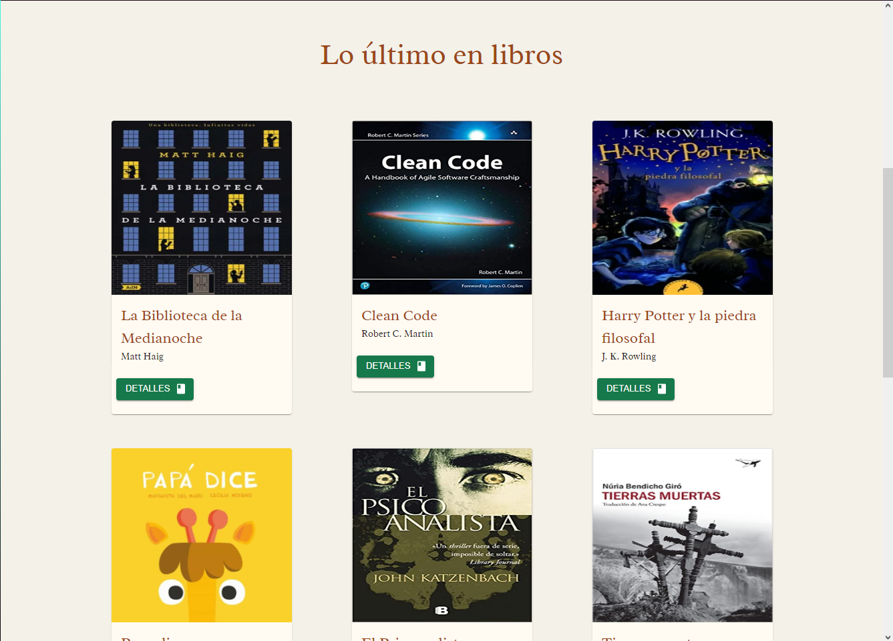
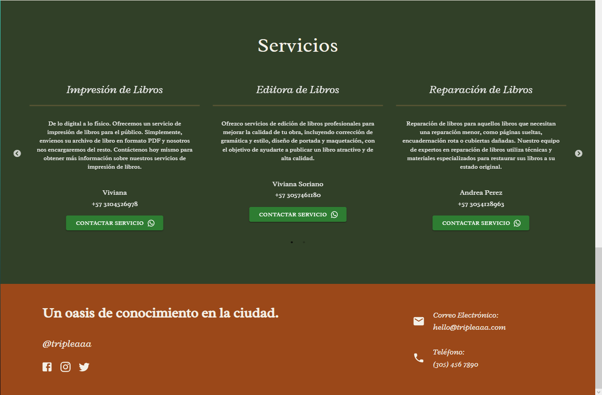
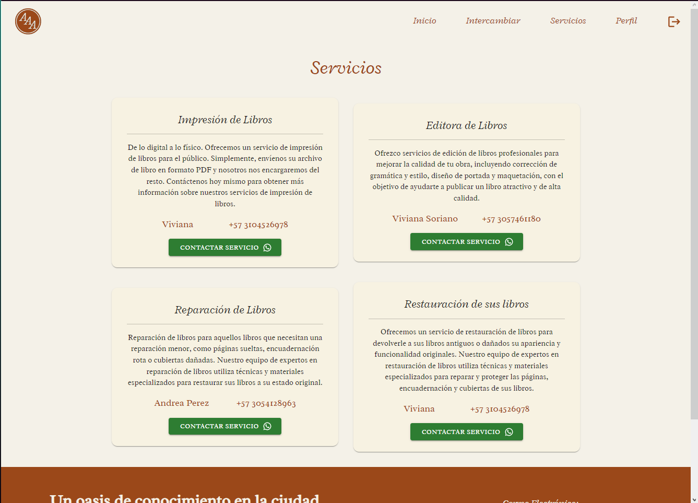
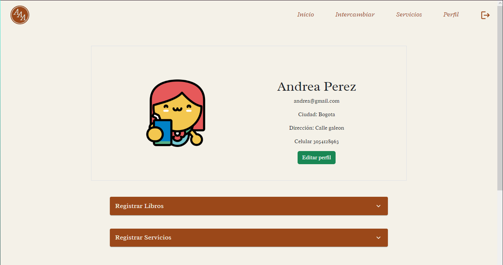
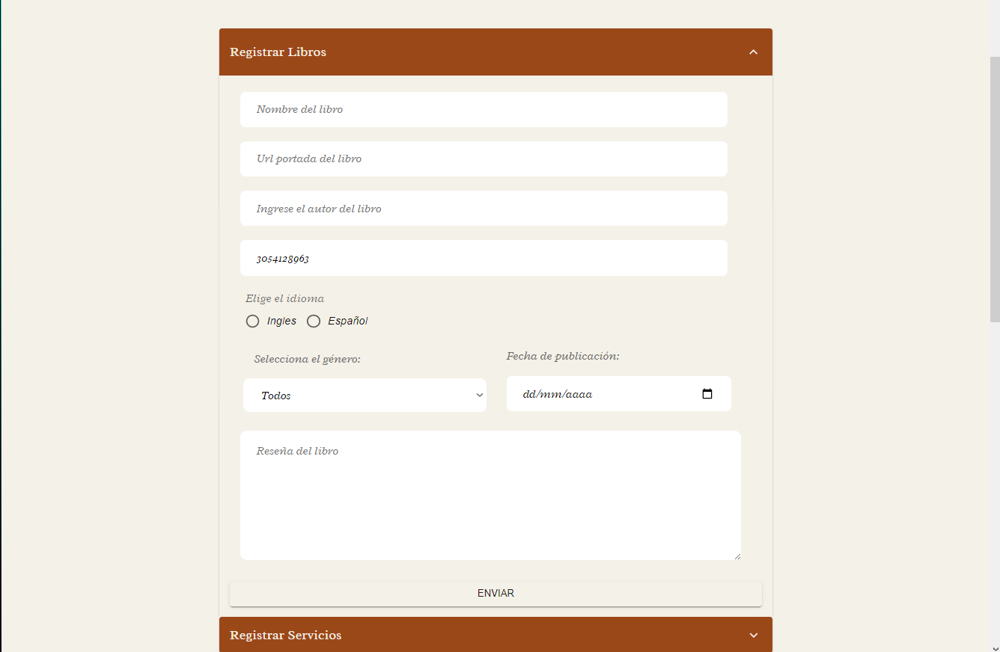
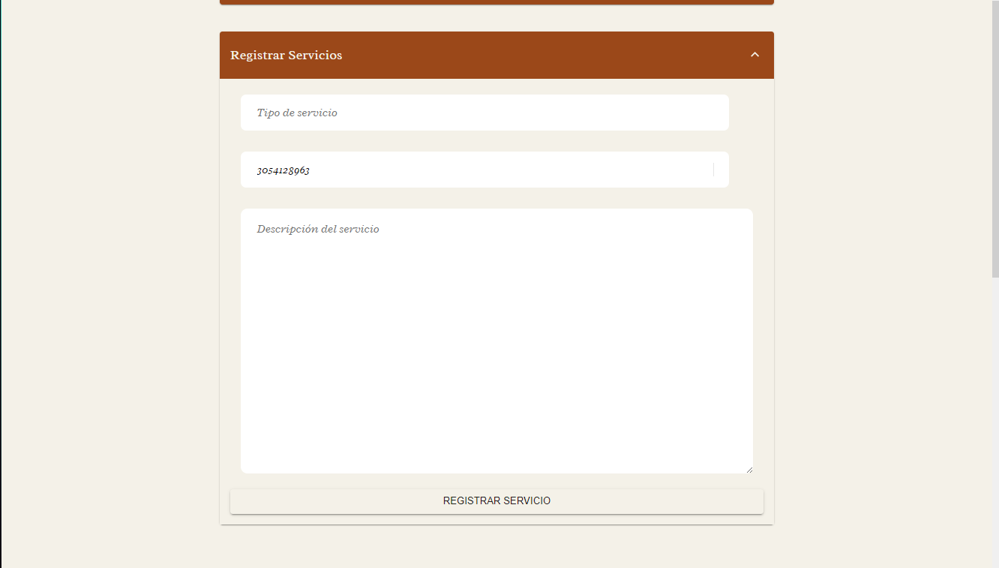
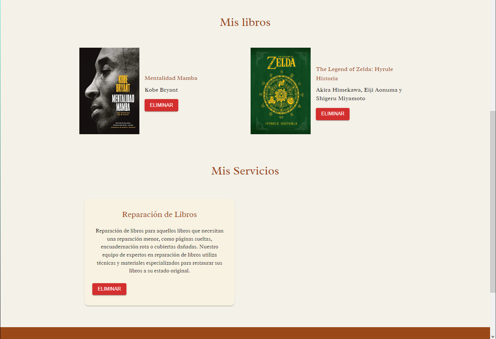
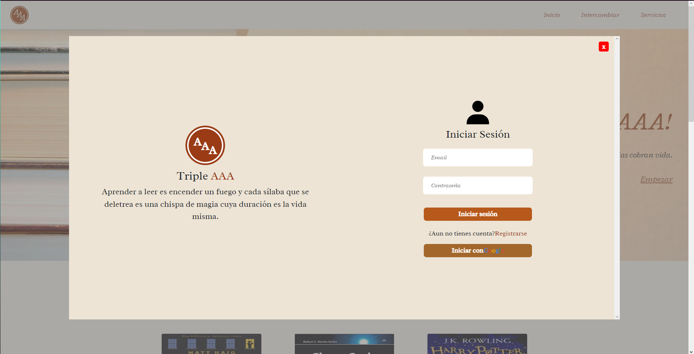
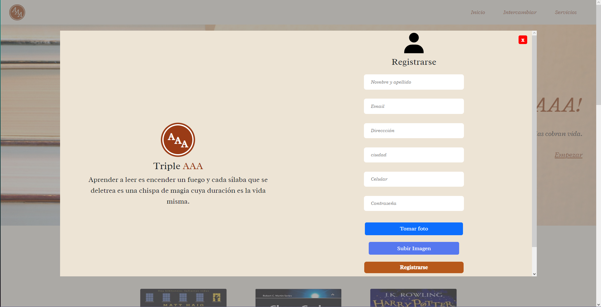

# Aplicación Librería Triple AAA

Link del Sitio Web: <a href= "https://makaia-libreria.web.app/#/">Sitio Web</a>

## Historias de Usuarios

- Crear una cuenta: Como usuario debes crear una cuenta para tener acceso a la información de contacto de los lectores y poder intercambiar libros o contactar un servicio.
- Inicio de Sesión: Como usuario puedes crear una cuenta o iniciar con tu cuenta de Google.
- Motor de búsqueda: Como usuario puedes buscar libros por su nombre.
- Perfil del usuario: Como usuario puedes ver en la página de perfil tus datos personales, tus libros compartidos y los servicios ofrecidos.
- Filtros: Como usuario puedes filtrar los libros por su género, autor, e idioma.
- Ordenamiento: Como usuario puedes ordenar productos en orden alfabético.
- Formulario de registro de libros: Como usuario puedes agregar libros a tu perfil diligenciando el formulario con la información de los libros.
- Formulario de registro de servicios: Como usuario puedes agregar servicios a tu perfil diligenciando el formulario con la información del servicio ofrecido.

## Inicio:

La primera página nos muestra el título, los últimos libros registrados y servicios que pueden ser de tu interés. También tenemos un botón que nos redirige al inicio, a la página de los libros a intercambiar, a la página de los servicios y un botón que nos redirige al perfil del usuario.

## Intercambiar:

Esta página nos muestra todos los libros que se encuentran disponibles para intercambio, permitiendo aplicar los filtros y orden que el usuario desee. Las tarjetas para cada libro tienen un botón para ver los detalles y la vista de los detalles tiene el botón para contactar al propietario por medio de WhatsApp.

## Servicios:

Esta página nos muestra los servicios que se encuentran publicados en la página, junto con el botón para contactar el servicio.

## Perfil:

En esta página se muestran los datos personales del usuario, asi como un botón que permite editarlos en caso de que los requiera. El formulario que permite agregar libros a su perfil y el formulario para agregar servicios que pueda ofrecer.

## Iniciar Sesión y Registro:

Aquí podemos registrarnos como usuarios con correo y contraseña o con la cuenta de Google.

## CRÉDITOS:

- React

- React-Redux

- Redux

- Material UI

- Firebase
